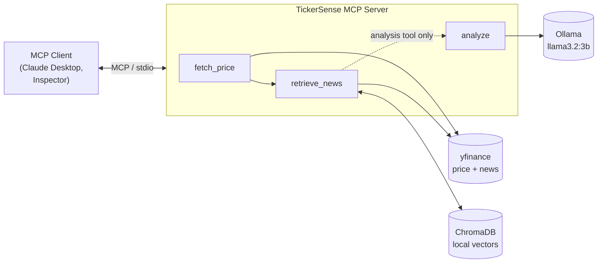

# TickerSense

An AI market-intelligence agent, exposed over the **Model Context Protocol (MCP)**
so any MCP client — Claude Desktop, the MCP Inspector, your own — can ask it about
a stock and get an answer grounded in *today's* news rather than a language
model's stale training data.

Runs entirely on free, local infrastructure. No API keys, no accounts, no bills.

Works for US tickers (`AAPL`) and Indian tickers on both NSE and BSE
(`RELIANCE.NS`, `TCS.BO`).

---

## What problem it solves

Ask a language model "how is Reliance doing?" and it answers from training data
that may be a year or more out of date — confidently, and with no way for you to
tell. News is the most time-sensitive data there is, which makes it the worst
possible thing to recall from memory.

TickerSense fixes that with retrieval-augmented generation (RAG). It fetches the
live price and recent news, embeds the articles into a local vector database,
retrieves the ones most relevant to price movement, and puts *those* in front of
the model — with an instruction to use nothing else. The output cites real
headlines because real headlines are the only facts it was given.

---

## Architecture



The agent is a **LangGraph** graph: a typed state dict flows through nodes, each a
plain function that reads state and returns an update. Two graphs are assembled
from one shared front half, which is what produces the two tools below.

| Node | Does | Cost |
|---|---|---|
| `fetch_price` | Live price snapshot via yfinance | ~1s |
| `retrieve_news` | Fetch news → embed into ChromaDB → retrieve top-3 by similarity | ~1s warm |
| `analyze` | Local LLM writes a grounded summary + sentiment | 45-105s |

---

## The two MCP tools

**`get_stock_snapshot(ticker)`** — price plus the most relevant retrieved
articles, returned as data. No LLM. **~1-2 seconds.**

**`get_stock_analysis(ticker)`** — the full pipeline including a locally-hosted
LLM that writes the summary. Fully offline and self-contained. **Often 60s+.**

Two tools rather than one, because of a measurement: local inference on modest
hardware couldn't reliably fit MCP's 60-second default client timeout. Rather than
keep optimizing, the design changed — **an MCP client is itself an LLM**, so
running a second, much weaker model locally to write a paragraph is redundant
*and* it's the slow part. The snapshot tool does all the same retrieval work and
hands the grounded data to the client to reason over.

The analysis tool stays because it proves the complete agent works with no
external model at all. The trade-off is stated plainly: the fast tool isn't
self-contained, which is exactly why both exist.

---

## Stack

| Layer | Choice | Why |
|---|---|---|
| Price + news | `yfinance` | Free, no key, covers US + Indian exchanges |
| Vector store | ChromaDB | Free, local, persistent, zero-config |
| Embeddings | `all-MiniLM-L6-v2` | Small, CPU-friendly, runs locally |
| LLM | Ollama + `llama3.2:3b` | Free, offline, unlimited |
| Orchestration | LangGraph | Explicit, debuggable state machine |
| Tool exposure | Official `mcp` Python SDK | Standard protocol, any client |

---

## Setup

Requires **Python 3.11+** and [Ollama](https://ollama.com).

```bash
git clone <repo-url>
cd TickerSense

python -m venv .venv
.venv\Scripts\activate          # Windows
# source .venv/bin/activate     # macOS / Linux

pip install -r requirements.txt
pip install -e .
```

Pull the model:

```bash
ollama pull llama3.2:3b
```

Configuration is optional — the defaults work as-is. To override the model or
Ollama's address, copy `.env.example` to `.env` and edit it.

---

## Run

**Command line:**

```bash
python scripts/run_agent.py AAPL
python scripts/run_agent.py RELIANCE.NS
```

**As an MCP server:**

```bash
python scripts/run_mcp_server.py
```

**Try it interactively** with the MCP Inspector, which is the easiest way to see
the tools working:

```bash
mcp dev src/tickersense/mcp/server.py
```

**Wire it into Claude Desktop** by adding this to
`claude_desktop_config.json`, using absolute paths:

```json
{
  "mcpServers": {
    "tickersense": {
      "command": "C:\\path\\to\\TickerSense\\.venv\\Scripts\\python.exe",
      "args": ["C:\\path\\to\\TickerSense\\scripts\\run_mcp_server.py"]
    }
  }
}
```

The server takes about 10 seconds to become ready — it loads the embedding model
at startup deliberately, so that cost isn't charged to your first request.

---

## Tests

```bash
pytest
```

These are integration tests: they hit live yfinance and a live model rather than
mocks. That's a deliberate trade — they catch real upstream API changes, which is
exactly what caught a change in Yahoo's news response shape during development —
but it means they're slow and need a network connection.

`tests/test_analyze.py` invokes the LLM and can take over a minute. To run just
the fast ones:

```bash
pytest --ignore=tests/test_analyze.py
```

---

## License

MIT
